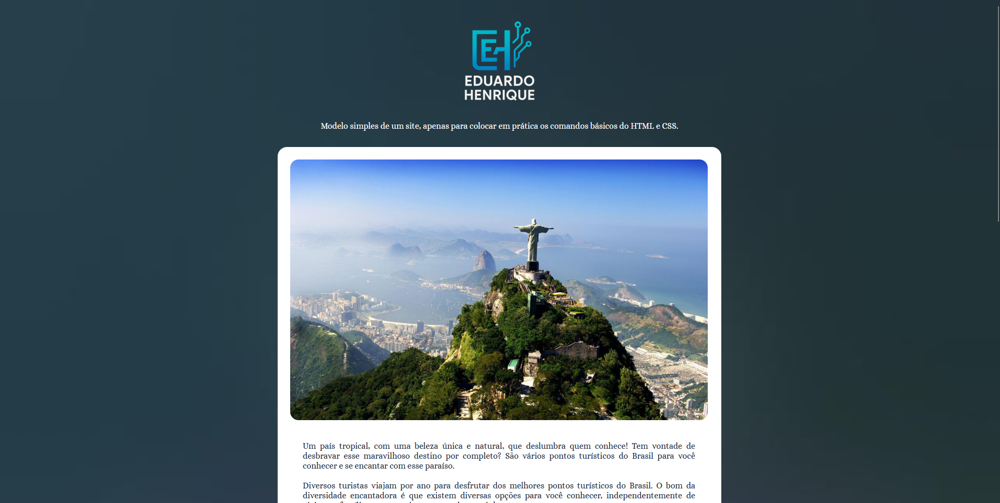

<h1 align="center"> DESAFIO PRÁTICO </h1>

Página simples, apenas para colocar em prática os comandos do HTML e CSS que estou aprendendo no curso do básico ao avançado.

  

## 🚀 Tecnologias

Esse projeto foi desenvolvido com as seguintes tecnologias:

- HTML e CSS
- Git e Github
